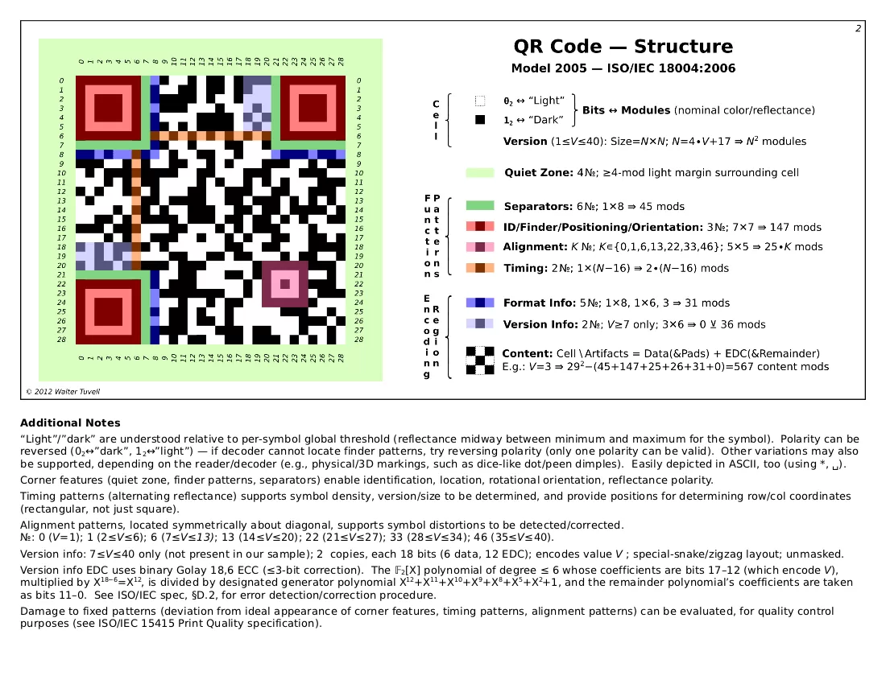
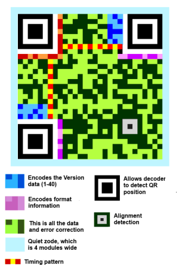

Checkpoints:
0. Comprendre comment fonctionne le QR Code. 
1. Définir le type d'information que vous souhaitez transmettre à l'aide de votre protocole graphique. Votre protocole doit être capable de transmettre le message de manière fiable et efficace, et cela peut nécessiter l'utilisation de techniques de détection et de correction d'erreurs (algo reed-solomon ou autre pour les erreurs).
    On peut utiliser des techniques telles que la redondance et l'encodage pour augmenter la fiabilité de votre protocole. Par exemple, vous pouvez inclure des bits de parité ou des codes de correction d'erreur pour aider à détecter et à corriger les erreurs dans le message.
2. Déterminer la taille et la forme de votre matrice. La taille de la matrice dépendra de la quantité d'information que vous souhaitez transmettre. Si vous avez besoin de transmettre un grand message, vous devrez utiliser une matrice plus grande. Cependant, une matrice plus grande peut rendre la lecture plus difficile et peut nécessiter plus de ressources pour être traitée.
3. Il est également important de prendre en compte les problèmes potentiels de distorsion ou d'altération qui peuvent survenir lors de l'impression ou de la visualisation de votre protocole. Vous pouvez utiliser des techniques telles que la correction de perspective pour compenser les distorsions qui peuvent survenir lors de la visualisation sous différents angles.
4. Concevoir les éléments spécifiques de votre protocole, tels que les marqueurs de début et de fin, les informations de taille et de résolution, et les codes de couleur.
5. Tester votre protocole pour vérifier son efficacité et sa fiabilité. Vous pouvez le faire en utilisant différents types de messages et en mesurant les taux d'erreur et le temps de traitement.

--- 

QR Code: 
A QR code is comprised of an array of squares, some of which are used for the image sensor to position itself (that's the large squares on three of the corners), while the rest of the cells contain version and format information as well as the data itself, of course, along with error correction coding.

Whereas most of the barcodes you come across are one-dimensional, such as UPC labels on items at the store, QR codes are two-dimensional and offer many advantages. For instance, QR codes can be scanned in any direction instead of only one, they can contain thousands of alphanumeric characters versus only a dozen or so, and when configured with a high level of error correction they are particularly capable at continuing to function after sustaining damage.

Les timing patterns (patterns de synchronisation) dans un QR code sont des bandes qui définissent le positionnement des lignes et des colonnes. Ils permettent de densifier le QR code par l’alternance de modules blancs et noirs, de déterminer la version du QR code et de fournir des positions de référence pour le calcul des coordonnées de chaque module.

---

#Notre code matriciel:

##Version 1: (copie de qr code version 1) 
- Taille de la matrice: 21x21 (comme la version 1 du QR code)
- Redondance: reed-salomon
- Niveau de correction (echelle de reed-salomon): L (faible, environ 7% des données du code peuvent être restaurées), il existe aussi M(15%), Q(25%), H(30%)
- Quantité de stockage: 152 bits = 19 characteres alphanumeriques

###Personnalisation possible pour projet:
- pixels de couleur pour le positionnement et l'alignement a la place des blocs (se baser sur les couleurs de base d'une imprimante)
- selon l'orientation lire differents contenu (possible?)

##Version beta 1: lire dans une image (faible resolution), un peu faire de la steganographie 

##Version beta 2: 1 info = une forme et pas un pixel (exemple: triomino ont une orientation et une couleur)

